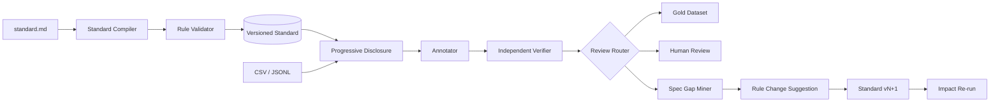

# LabelSpec

[简体中文](README.zh-CN.md)

LabelSpec compiles natural-language business standards into versioned, executable rules for reliable single-label text classification.

Its primary asset is not a prompt or a model. It is a traceable standard made of Definition, Boundary, and Priority Rules, plus the real cases that drive those rules forward.

```text
Standard -> Data -> Model -> Failure -> Standard
```

## Features

- Upload MD, TXT, DOCX, text-based PDF, CSV, and XLSX standard documents together
- Merge per-document extraction with source references and explicit conflict detection
- Model arbitrary-depth label trees and classify only nodes without children
- Inherit the full ancestor Definition chain while keeping each node's definition local
- Recall candidates level by level before disclosing relevant Boundary, Priority, and historical cases
- Create immutable, field-diffed versions for every explicit manual edit
- Validate tree structure, Rule IDs, references, scopes, and unresolved source conflicts
- Independently run an Annotator and Verifier before deterministic routing
- Route every result to `AUTO_ACCEPT`, `REVIEW`, `AMBIGUOUS`, or `SPEC_GAP`
- Cluster repeated failures and generate reviewable Rule change suggestions
- Create immutable Standard versions and reprocess only impacted cases
- Compare accuracy, auto-accept rate, review rate, and Rule conflict rate across versions
- Operate from a Chinese web workspace or CLI

## Requirements

- Python 3.9+
- Node.js 20+
- A Baidu AI Cloud Qianfan ModelBuilder API Key

LabelSpec intentionally has no mock model provider. Compiling, annotating, verifying, embedding, and mining all require a real API Key.

## Quick Start

```bash
git clone <your-fork-or-repository-url>
cd labelspec
make install
cp .env.example .env
```

Set the required value in `.env`:

```dotenv
QIANFAN_API_KEY=bce-v3/your-api-key
```

Build the web app and start LabelSpec:

```bash
make run
```

Open [http://127.0.0.1:8000](http://127.0.0.1:8000). API documentation is available at [http://127.0.0.1:8000/docs](http://127.0.0.1:8000/docs).

Model calls use Qianfan V2 endpoints:

- `POST https://qianfan.baidubce.com/v2/chat/completions`
- `POST https://qianfan.baidubce.com/v2/embeddings`
- `GET https://qianfan.baidubce.com/v2/models`

The API Key is read only by the backend and is never stored in the browser or SQLite. Compiler, Annotator, Verifier, Spec Gap Miner, and Embedding models can each be selected in the UI.

## Development

Start both processes in separate terminals:

```bash
make dev-backend
make dev-frontend
```

The web app runs at `http://127.0.0.1:5173` and proxies `/api` to the backend.

Run verification:

```bash
make test
```

## CLI

```bash
labelspec --help
labelspec settings
labelspec compile standard.md supplemental-boundaries.docx --name "Support Intent" --output-dir ./compiled
labelspec validate \
  --labels-yaml compiled/labels.yaml \
  --definitions-yaml compiled/definition_rules.yaml \
  --decisions-yaml compiled/decision_rules.yaml
labelspec activate <standard-id>
labelspec import-data cases.jsonl
labelspec annotate <dataset-id> <standard-id> --concurrency 4
labelspec mine <run-id>
labelspec revise <standard-id> <rule-id> edited-rule.json --reason "Reviewed change"
labelspec impact-rerun <source-run-id> <target-standard-id> <rule-id>
labelspec export-results <run-id> results.jsonl --gold-only
```

The built-in standard and CSV dataset are available from the web workspace. Importing the demo dataset does not bypass the API Key requirement for model operations.

## Architecture



The backend uses FastAPI and SQLite. The frontend uses React and TypeScript. Vectors are stored locally in SQLite and are used only for historical-case retrieval and failure clustering, never as the business decision standard.

## Data and Cost

Texts and standards sent to configured models are processed by Qianfan under your account. Review the provider's privacy, retention, quota, and billing terms before using production or sensitive data. LabelSpec stores workspace data in `backend/data/labelspec.db` by default.

## Scope

Version 0.2 supports single-label text classification with leaves at arbitrary depths. Scanned PDF OCR, model training, and fine-tuning are out of scope.

## Contributing

See [CONTRIBUTING.md](CONTRIBUTING.md). Security issues should follow [SECURITY.md](SECURITY.md).

## License

Apache License 2.0. See [LICENSE](LICENSE).
